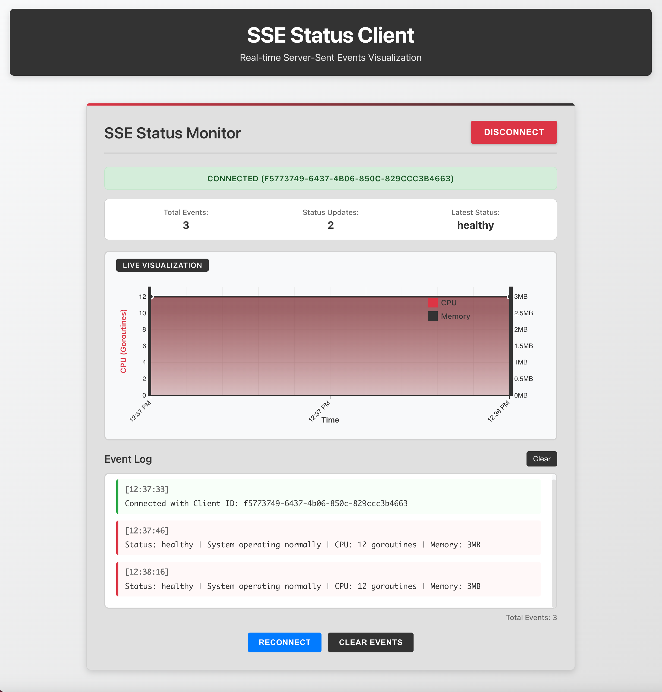

# SSE Status Server (Go w/ React.js and D3.js)
Production-grade SSE (Server-Sent-Events) Status Server Architecture Workflow using Go, GoFr w/ React.js/D3.js Client Application

SSE provides Uni-Directional (Server-to-Client) Real-Time Texttual Event Streaming (live feeds, live feed display, live progress updates). 





The Go GoFr server is configured to use SSE as follows.

```go
    ...
// HandleSSEGoFr handles SSE connections using GoFr context
func (h *SSEHandler) HandleSSEGoFr(ctx *gofr.Context) (interface{}, error) {
	// Get the underlying response writer and request
	w := ctx.Context.Value("responseWriter").(http.ResponseWriter)
	r := ctx.Context.Value("request").(*http.Request)

	// Set SSE headers
	w.Header().Set("Content-Type", "text/event-stream")
	w.Header().Set("Cache-Control", "no-cache")
	w.Header().Set("Connection", "keep-alive")
	w.Header().Set("Access-Control-Allow-Origin", "*")
	w.Header().Set("Access-Control-Allow-Headers", "Content-Type")

	// Handle preflight requests
	if r.Method == "OPTIONS" {
		w.WriteHeader(http.StatusOK)
		return nil, nil
	}

	// Create client
	clientID := uuid.New().String()
	client := &sse.Client{
		ID:     clientID,
		Events: make(chan structures.Event, 10),
	}

	// Register client
	h.eventcaster.Register(client)

	// Send initial connection event
	fmt.Fprintf(w, "id: %s\nevent: connected\ndata: {\"clientId\":\"%s\"}\n\n", clientID, clientID)
	if flusher, ok := w.(http.Flusher); ok {
		flusher.Flush()
	}

	// Ensure cleanup
	defer h.eventcaster.Unregister(clientID)

	// Listen for events or client disconnect
	for {
		select {
		case event, ok := <-client.Events:
			if !ok {
				return nil, nil
			}
			fmt.Fprint(w, sse.SerializeEvent(event))
			if flusher, ok := w.(http.Flusher); ok {
				flusher.Flush()
			}
		case <-r.Context().Done():
			return nil, nil
		}
	}
}
```


## SSE vs WebSockets

- SSE is Uni-Directional (server-to-client), WebSockets is Bi-Directional
- SSE uses HTTP/HTTPS, WebSockets uses WS/WSS
- SSE provides Pre-Integrated Auto-Reconnect, WebSockets does NOT
- SSE is Firewall Adaptive, WebSockets is NOT
- SSE Message Format is Text-ONLY, WebSockets Message Format is Text and Binary
- Performance Overhead is lower with SEE and higher with WebSockets


## Create the Client React.js App

```shell
npx create-react-app client
cd client
npm install d3
```

or using `Vite` as `npx create-react-app` is now deprecated.

```shell
npm create vite@latest client -- --template react
cd client
npm install d3
npm run dev
```


## Executing the Server

To run the server (not as a container)

```shell
make run
```

To run the server as a container

```shell
make docker-deploy
make docker-run
```


## Executing the Client 

To run the client (not as a container)

```shell
make install   # Install the client app package dependencies
make start
```

To run the client as a container

```shell
make docker-deploy
make docker-run
```